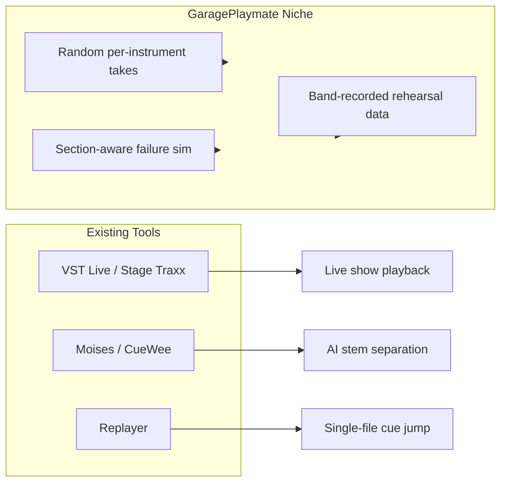
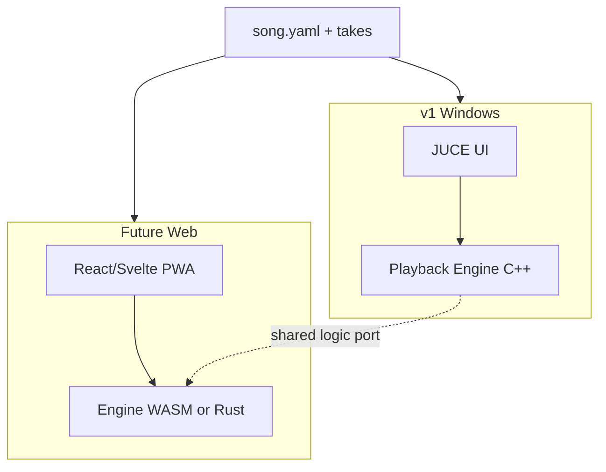

# GaragePlaymate — Product Design Document (PDD)

**Working name:** GaragePlaymate  
**Version scope:** v1.0 (Windows desktop)  
**Distribution:** Open source  
**Document purpose:** Input for an architecture agent to propose system design and decompose implementation tasks for development agents.

---

## 1. Executive Summary

GaragePlaymate is a Windows desktop application that helps recreational musicians practice at home under conditions closer to real band rehearsals. Unlike typical backing-track players (YouTube, stem apps, or live-performance tools like VST Live), GaragePlaymate deliberately introduces **unpredictability**: each playback session randomly selects one pre-recorded take per instrument, and optionally simulates technical failures (e.g., a track dropping out until the next song section).

**Core insight:** Predictable backing tracks train muscle memory for a fixed arrangement; real rehearsals train **listening, recovery, and adaptation**.

**v1 goal:** Ship a focused, folder-based multitrack player with setlists, section markers, random take selection, playback history, and one failure simulation mode — no EQ, no VST hosting, no built-in cloud sync, no alignment validation (archivist prepares files correctly; variable take endings supported).

---

## 2. Problem Statement

| Problem | Who feels it | Current workaround | Why it fails |
|---|---|---|---|
| Home practice uses fixed backing tracks | Recreational band members practicing 4–6 days/week alone | YouTube, Moises/Stemify, DAW projects | Same mix every time; no human variation |
| Mistakes by other musicians are rare in solo practice | All instrumentalists | Only at 1–2 weekly rehearsals | Too little exposure to adapt |
| Technical failures on stage/rehearsal | Bands without dedicated sound engineer | Hope + occasional dress rehearsal | Hard to rehearse failure recovery at home |
| Band-specific recordings are unused | Bands that record rehearsals | Manual DAW sessions, shared MP3s | No tool designed for “10–20 takes per instrument” workflow |

**Success criteria (v1):**

- A musician can practice 10 songs from a setlist in one session, each run feeling different.
- They can replay a specific random combination they liked or struggled with.
- Optional failure mode triggers at least once per ~5–10 sessions (configurable), recovering at the next section boundary.
- Zero in-app setup to start practicing after song folders are placed in the data directory (see NFR-UX-01).

---

## 3. Competitive Landscape

### 3.1 Direct overlap (partial)

| Product | Overlap | Gap vs GaragePlaymate |
|---|---|---|
| [Steinberg VST Live](https://www.steinberg.net/vst-live/) | Setlists, song parts/sections, multitrack layers, live performance | Commercial; complex; no random takes; no failure simulation; rehearsal-record workflow not first-class |
| [MUSE Backing Track Player](https://apps.apple.com/us/app/muse-backing-track-player/id6755925900) | Setlists, section markers, per-track volume | iOS-focused; no multiversions; no failure sim |
| [Stage Traxx 4](https://stagetraxx.com/) | 32-track playback, setlists, section regions | iPad/Mac; live-show oriented; no random takes |
| [Replayer](https://replayer.app/) (open source) | Setlists, named cues/sections, Windows + PWA | Cue-based **single-file** playback; not multitrack random takes |
| [MStarPlayer](https://github.com/ServiusHack/MStarPlayer) | JUCE/C++, ASIO, multitrack WAV/MP3 | Player only; no setlists, takes, or simulation |
| [CueWee](https://www.cuewee.app/) / Moises / SplitJam | Stem separation, mixer, sections | AI stems from commercial recordings; not band rehearsal takes |

### 3.2 Adjacent (not substitutes)

- **DAWs** (Reaper, Ableton): Can script random clips, but high setup cost, not musician-friendly.
- **Live performance suites** (Camelot, Livetraker, Jamzone, PadVox): Stage routing, lyrics, MIDI — opposite of “unprepared home practice.”
- **Remote jam** (JamKazam): Solves distance, not solo unpredictability.
- **SongLab** ([GitHub](https://github.com/elbeh/songlab)): Browser band sync for notation; explicitly **no audio streaming**.

### 3.3 Conclusion

**No ready-to-use solution** implements the combination of:

1. Folder-discovered multitrack songs with **multiple manually aligned takes per instrument**
2. **Random take selection** per playback with **history/replay**
3. **Probabilistic technical failure simulation** tied to section boundaries

GaragePlaymate occupies a **new niche**: “rehearsal unpredictability trainer,” not a live-show player or AI stem tool.



---

## 4. Target Users and Personas

**Primary:** Recreational band member (guitar/bass/keys/vocals/drums) practicing 3–6×/week at home, band rehearses 1–2×/week.

**Secondary:** Band “archivist” — records rehearsals, cuts takes, distributes song folders to members.

**Non-goals (v1):** Professional touring acts, music teachers needing notation, users wanting YouTube/Spotify integration.

---

## 5. User Stories (v1)

### Library and setlists

- As a user, I open the app and see all songs discovered from the data folder without import dialogs.
- As a user, I create multiple setlists and assign songs to them.
- As a user, I see section names (Verse, Chorus, etc.) on the timeline and can jump to a section.
- As a user, I can point the data directory to any folder on my system — including a cloud-synced location such as OneDrive — so my band’s song library stays shared across machines.

### Playback and mixing

- As a user, I press Play and hear all instrument tracks mixed with per-track volume sliders.
- As a user, I can mute or solo individual tracks when those controls are available, to focus practice on specific parts.
- As a user without an ASIO audio interface, I can use the app immediately through normal Windows audio (speakers, headphones, Bluetooth) with no extra driver installation.
- As a user on a slow HDD or weaker PC, I can enable “Preload into RAM” so selected takes are fully loaded before playback, avoiding disk read stutter during practice.

### Random takes (flagship)

- As a user, each time I press Play, the app picks **one random take per instrument track** (uniform among available takes).
- As a user, I see which take variant was selected for each instrument in the current session.
- As a user, I browse playback history and **replay an exact prior combination** (same take IDs per instrument).
- As a user, I can exclude specific takes from the random pool (e.g., unusable recording).
- As a user, when random selection yields takes of different lengths, the song runs until the longest take ends — shorter tracks fall silent when their take finishes (e.g., drummer stops while guitarist lets a chord ring).

### Failure simulation (v1: one mode)

- As a user, I enable “Technical problems” with a probability slider (e.g., 5–30%).
- As a user, when triggered, **one randomly chosen track** fades to a configurable level (not necessarily silence) at a random time, and **restores at the start of the next section**.
- As a user, I see a non-intrusive indicator that a simulated problem occurred (for reflection after the run).

### Content authoring (external + light in-app)

- As a band archivist, I add a new song by creating a folder with audio files and a manifest; the app picks it up on restart (or manual rescan).
- As a band archivist, I add new takes to an existing instrument folder and rescan.
- As a band archivist, I am solely responsible for trimming all takes so bar 0 is at file start — the app plays from `00:00` without checking alignment.

---

## 6. Functional Requirements

### 6.1 Song library

- **FR-LIB-01:** Scan configurable root data directory recursively on startup and on user “Rescan.”
- **FR-LIB-02:** Display song list with metadata: title, artist (optional), BPM (optional), track count, take counts.
- **FR-LIB-03:** Support multiple setlists; a song may appear in zero or more setlists.
- **FR-LIB-04:** Persist setlists and user settings in app config (not inside song folders).
- **FR-LIB-05:** Data root path is user-configurable to any valid directory path (local disk, network share, or cloud-synced folder such as `%USERPROFILE%/OneDrive/GaragePlaymate`).

### 6.2 Song data model (folder contract)

Proposed on-disk layout (architecture agent may refine):

```
{DataRoot}/
  songs/
    {song-id}/                    # slug, e.g. "sweet-child-o-mine"
      song.yaml                   # manifest (required)
      sections.yaml               # optional; can be inline in song.yaml
      tracks/
        drums/
          take-01.wav
          take-02.wav
        bass/
          take-01.wav
          take-03.wav
        guitar/
          ...
        vocals/
          ...
```

**`song.yaml` (minimum fields):**

```yaml
id: sweet-child-o-mine
title: Sweet Child O' Mine
bpm: 120                    # optional; used for display / future metronome
timeSignature: [4, 4]         # optional
grid:
  reference: take-01        # optional creator documentation only; not used by app in v1
  barDurationMs: 2000         # optional; for creator documentation only
tracks:
  - id: drums
    name: Drums
    folder: tracks/drums
    defaultVolume: 1.0
  - id: bass
    name: Bass
    folder: tracks/bass
    defaultVolume: 0.9
sections:
  - id: intro
    name: Intro
    startMs: 0
  - id: verse1
    name: Verse 1
    startMs: 15300
  - id: chorus1
    name: Chorus
    startMs: 45200
```

**Alignment rule (archivist responsibility, no app validation in v1):**

- **Playback start:** The app always begins every track at file position `00:00`. No offset correction, trimming, or auto-alignment.
- **Start alignment (archivist responsibility):** The archivist must ensure all takes across all instruments are trimmed so bar 0 of the song is at the start of every audio file. If alignment is wrong, playback will simply sound wrong — v1 does not detect or warn about this.
- **End alignment (not required):** Takes may end at different times. Variable endings are a feature — e.g., one guitar take rings out longer than another, mimicking real rehearsal variation.
- **No scan-time validation:** v1 accepts all audio files found in track folders. The only exclusion mechanism is manual disable by the user (e.g., marking a take as unusable).

**Supported audio (v1):** **WAV only** — PCM 16/24/32-bit, 44.1 kHz or 48 kHz. No MP3 or other compressed formats in v1.

### 6.3 Playback engine

- **FR-PLAY-01:** All active tracks start simultaneously from file position `00:00` (sample-accurate sync across tracks).
- **FR-PLAY-02:** Per-track gain control (0.0–1.0 linear or dB — pick one, document).
- **FR-PLAY-03:** Transport: Play, Pause, Stop, Seek to section start.
- **FR-PLAY-04:** Session duration = **max duration among the currently selected takes** across all tracks. Playback continues until the longest selected take finishes.
- **FR-PLAY-05:** When a shorter track reaches its end, it goes silent (gain 0) for the remainder of the session; other tracks continue until the longest ends.
- **FR-PLAY-06:** Audio output must work on **standard Windows audio hardware without ASIO** (built-in speakers, Bluetooth headphones, consumer USB interfaces). Default driver: **WASAPI** (Windows Audio Session API). **ASIO** is optional for users with professional/low-latency interfaces.
- **FR-PLAY-07:** Audio device settings expose driver type (WASAPI / ASIO), output device list, and buffer size. On first launch, auto-select the system default WASAPI output so the app is usable immediately without configuration.
- **FR-PLAY-08:** If the selected ASIO device becomes unavailable, fall back to the last-used or default WASAPI device with a clear notification (no silent failure).
- **FR-PLAY-09:** User-selectable **audio loading mode** (global setting, similar to VST Live):
  - **Stream (default):** Read selected take audio from disk during playback. Lower memory use; suitable for SSDs and machines with ample RAM headroom.
  - **Preload into RAM:** On Play, after take selection, decode and load the **currently selected takes only** into memory before playback starts. Reduces HDD/streaming stutter on weaker machines or slow drives. Show a loading progress indicator; disable Play until preload completes (or allow cancel).
- **FR-PLAY-10:** In Preload mode, memory is allocated on the main/loader thread before the audio thread starts — no allocations on the audio thread during playback (consistent with NFR-REL-01).
- **FR-PLAY-11 (nice-to-have):** Per-track **mute** and **solo** controls. Not required for v1 release; include if implementation cost is low (e.g., trivial gain-routing flags on existing mixer channels). If omitted, per-track volume sliders remain sufficient.

### 6.4 Random take selection

- **FR-RAND-01:** On each Play from stopped state, assign `takeId` per track uniformly at random from non-disabled takes.
- **FR-RAND-02:** While playing, changing take selection requires Stop → Play (no hot-swap mid-song in v1).
- **FR-RAND-03:** Persist session record: timestamp, songId, map of `trackId → takeId`, failure events.

### 6.5 Playback history

- **FR-HIST-01:** List recent sessions per song, retaining the **last 100 sessions per song** (count-based limit; oldest entries pruned automatically).
- **FR-HIST-02:** “Replay this version” locks take map and bypasses random selection for that run.
- **FR-HIST-03:** Display human-readable take labels (filename or index).

### 6.6 Technical failure simulation (v1 single mode)

- **FR-FAIL-01:** Global enable + probability `p` per song play (Bernoulli trial at play start).
- **FR-FAIL-02:** If triggered, select one random track and random onset time `t` within a playable window (exclude last section or last N seconds — configurable constant).
- **FR-FAIL-03:** At `t`, ramp track gain to `failureLevel` (default 0.15, range 0.0–0.5) over `fadeMs` (default 300ms).
- **FR-FAIL-04:** Restore to normal gain at **next section boundary** (`sections[n+1].startMs`).
- **FR-FAIL-05:** If failure triggers in last section, restore at session end (when longest selected take finishes) or skip failure — **recommend:** no failure in last section.
- **FR-FAIL-06:** Log failure in session history for review.

### 6.7 Settings and distribution modes

- **Data root path:** User-configurable. Defaults depend on distribution package:
  - **Portable build:** `{exe_dir}/data/` — songs live beside the executable; suitable for USB stick or self-contained folder.
  - **Installed build:** `%USERPROFILE%/Documents/GaragePlaymate/` — standard per-user location on first run.
  - User may override either default to any path (e.g., `%USERPROFILE%/OneDrive/BandName/songs`).
- **Audio:** driver type (WASAPI / ASIO), output device, buffer size. WASAPI pre-selected on first run.
- **Audio loading mode:** Stream from disk (default) or Preload into RAM.
- **Failure simulation defaults.**
- **Rescan library.**

---

## 7. Non-Functional Requirements

| ID | Requirement | Target (v1) |
|---|---|---|
| NFR-PERF-01 | Playback start latency after Play | < 200ms (WASAPI default); < 100ms (ASIO, 128–256 buffer) |
| NFR-PERF-02 | CPU usage during 8-track playback | < 15% on mid-range PC |
| NFR-PERF-03 | Memory / loading | **Stream (default):** disk I/O during playback; only selected takes opened. **Preload mode:** hold selected takes in RAM for current session; release on Stop or song change. Never preload all takes in library at once. |
| NFR-PERF-04 | Preload wait time | Show progress; target < 5s for a typical 4-min 8-track song on HDD (architecture agent to benchmark) |
| NFR-REL-01 | No audio thread allocations during playback | Required |
| NFR-UX-01 | Zero-config first practice | After song folders exist in the data directory, a new user can hear playback **without configuring the app** — no import wizard, no audio setup, no per-song registration. WASAPI default device is used automatically. User actions allowed: install app, copy folders, open app (or Rescan), select song, press Play. **Out of scope for this metric:** DAW prep by archivist (trimming takes, writing `song.yaml`). Target: first playback within **5 minutes** of copying a valid song folder on a typical Windows laptop. |
| NFR-PORT-01 | Platform | Windows 10/11 x64 only |
| NFR-DIST-01 | Distribution | **Open source** (GPL-3.0 recommended); portable ZIP + Windows installer |

---

## 8. UI Outline (v1)

Minimal screens — architecture agent designs components:

1. **Library** — song grid/list, setlist sidebar, search/filter.
2. **Song detail** — section strip, per-track take indicators (current selection), volume sliders, mute/solo buttons (if FR-PLAY-11 shipped), Play, optional preload progress bar.
3. **Session bar** — now playing, section highlight, failure indicator, elapsed time.
4. **History panel** — per-song session list (up to 100), Replay button.
5. **Settings** — data path (with folder picker), audio, loading mode, failure defaults.

**Keyboard shortcuts (recommended):** Space = Play/Pause, Left/Right = previous/next section, R = rescan.

No waveform editor, no take alignment UI in v1.

---

## 9. Technology Stack Recommendation

### 9.1 Recommended for v1: **C++20 + JUCE 8**

| Layer | Choice | Rationale |
|---|---|---|
| Audio I/O | JUCE `AudioDeviceManager` — **WASAPI default**, ASIO optional | Works on any Windows PC; ASIO for pro interfaces only |
| Multitrack engine | JUCE `MixerAudioSource` + per-track `AudioFormatReaderSource` or in-memory `AudioBuffer` sources | Stream-by-default; RAM buffer swap when Preload mode enabled |
| UI | JUCE native UI | Single framework; avoids Qt+ASIO glue |
| Config/metadata | YAML via `yaml-cpp` or JSON via `nlohmann/json` | Human-editable song manifests |
| Persistence | SQLite for setlists, settings, session history | Simple queries for history |
| Build | CMake + MSVC 2026 (Visual Studio 2026) | Windows standard |
| Distribution | Portable ZIP + MSI/NSIS installer | Two packages, shared binary; different default data paths |

**Why not pure Qt + ASIO:** Qt excels at UI but has no mature built-in ASIO multitrack engine; you would still embed RtAudio/JUCE/PortAudio for playback, increasing integration risk.

**Why not Electron/Tauri for v1:** WebAudio in embedded WebView adds latency and jitter; professional multitrack sync wants a real-time audio thread. Tauri+Rust is viable for v2 if engine is shared.

**Optional accelerator:** [Tracktion Engine](https://github.com/tracktion/tracktion_engine) (JUCE module) — powerful but licensing complexity; likely **overkill** for v1.

### 9.2 User hypothesis evaluation

> C++, ASIO, Qt

**Verdict:** Half right. **C++ + JUCE** is the better default than Qt for this product class. **WASAPI** covers recreational home users; **ASIO** is an optional upgrade path, not a requirement.

### 9.3 Licensing (decided: open source)

| Component | License implication |
|---|---|
| GaragePlaymate | **GPL-3.0** (recommended) — aligns with JUCE GPL path and community distribution |
| JUCE | Free when project is GPL-licensed open source |
| ASIO SDK | Steinberg license applies to ASIO headers when `JUCE_ASIO` is enabled; document in `LICENSE` and `NOTICE` files |
| yaml-cpp / nlohmann-json / SQLite | Permissive licenses; include notices |

**Release artifacts:**

- Source repository (public)
- Portable ZIP (exe + default `./data/` folder)
- Windows installer (per-user `%USERPROFILE%/Documents/GaragePlaymate/` default)

---

## 10. Web / Cross-Platform Feasibility (Future — v2+)

### 10.1 What transfers cleanly

- Song folder contract (`song.yaml`, takes per instrument)
- Random take selection logic
- Failure simulation logic (section-aware gain automation)
- Setlists and session history (IndexedDB or server)

### 10.2 Technical approach options

| Approach | Pros | Cons |
|---|---|---|
| **PWA + Web Audio API** | No install; cross-device; [Replayer PWA](https://github.com/suterma/replayer-pwa) precedent | Large RAM if decoding many WAVs; Bluetooth latency; no ASIO |
| **PWA + HLS streaming stems** ([stemplayer-js](https://github.com/stemplayer-js/stemplayer-js)) | Handles long songs, lower memory | Requires transcode pipeline; more infra |
| **Shared Rust/C++ core + WASM** | One engine, web + desktop | Significant port effort; WASM file I/O limits |
| **Tauri 2 + same Rust audio engine as desktop** | Reuse engine; small binary | Still WebView UI; audio must stay in Rust |

### 10.3 Web-specific constraints

- **Sync:** Solvable — decode to `AudioBuffer`, schedule shared `startTime`.
- **File access:** File System Access API (Chrome/Edge) or zip upload; iOS Safari is limited.
- **Practice use case fit:** Good for **random takes + failure sim** (latency 50–150ms acceptable for home practice). Poor for **low-latency IEM monitoring**.

**Recommendation:** Design v1 engine with **UI/engine separation** so core logic can compile to WASM or Rust later. Do not block v1 on web.



---

## 11. Out of Scope (v1)

- Automatic take alignment / time-stretch
- EQ, compression, VST/AU plugins
- Recording inside the app
- Built-in cloud sync, user accounts, collaboration (user may point data path at OneDrive/etc. manually)
- YouTube/streaming import
- MP3 and other compressed audio formats
- MIDI, lyrics, chords display
- macOS/Linux builds
- Multiple simultaneous failure types
- Mobile native apps

### v1.1+ candidates

- MP3/FLAC decode support
- Additional failure modes (click drop, brief mute, wrong section cue)
- In-app take validator (start-offset / waveform onset detection)
- macOS build (CoreAudio)
- Simple metronome overlay
- Export “practice session report”

---

## 12. Risks and Mitigations

| Risk | Impact | Mitigation |
|---|---|---|
| Misaligned takes prepared by archivist | Incorrect playback (tracks out of sync) | Document archivist workflow; no v1 detection — user fixes source files |
| Very long tail on one take extends session | User surprised by extra silence from other tracks | Show per-track duration in take selection UI; end session when longest track ends |
| ASIO driver quirks or missing ASIO hardware | User cannot hear audio | WASAPI as default; device picker with plain-language labels; graceful ASIO→WASAPI fallback |
| Preload mode on large songs / many tracks | High RAM use or long wait before Play | Preload selected takes only; show memory estimate + progress; fall back to Stream if insufficient RAM |
| Disk streaming on slow HDD | Audible glitches during playback | Preload into RAM setting; recommend SSD/WAV in archivist docs |
| Cloud-synced data path (OneDrive) | Brief file lock or sync delay during scan | Scan is read-only; tolerate missing files gracefully; document “pause sync during practice” if needed |
| Scope creep toward DAW | Never ships | Strict out-of-scope list (Section 11) |

---

## 13. Acceptance Tests (v1)

1. Drop a valid 4-track song folder with 3 WAV takes each → appears in library after rescan.
2. Fresh install, valid song folder present, user never opens Settings → song plays via WASAPI default output (NFR-UX-01).
3. Press Play 20 times → at least 2 distinct take combinations observed (probabilistic).
4. Replay history entry → identical takes selected.
5. Enable 100% failure probability → one track drops before next section and recovers at section boundary.
6. Setlist of 5 songs → navigate and play without restart.
7. Song with takes of different lengths (e.g., guitar 3:45, drums 3:30) → drums silent after 3:30, guitar continues to 3:45, session ends at 3:45.
8. Fresh install on laptop with only built-in speakers (no ASIO drivers) → plays via WASAPI default device without configuration.
9. Machine with ASIO interface → user can switch to ASIO in settings for lower latency.
10. Preload mode enabled → Play shows loading progress, then glitch-free playback from RAM; memory released on Stop.
11. Portable build defaults to `{exe_dir}/data/`; installed build defaults to `Documents/GaragePlaymate/`; user can override to OneDrive path.
12. Session history retains 100 entries per song; entry 101 evicts oldest.
13. Non-WAV file in track folder → ignored or warned; playback uses WAV takes only.

---

## 14. Suggested Milestones for Architecture Agent

Architecture agent should decompose into epics:

1. **E1: Project scaffold** — CMake, JUCE, GPL LICENSE, WASAPI-first audio output, optional ASIO, device selector UI.
2. **E2: Song scanner** — folder contract parser, WAV-only filter, library DB (no alignment validation).
3. **E3: Playback engine** — multitrack sync, transport, per-track gain, optional mute/solo.
4. **E4: Section navigation** — seek, UI markers, “next section” for failure recovery.
5. **E5: Random takes + session model** — selection, persistence, history UI (100/song cap).
6. **E6: Failure simulator** — probability, fade, section-boundary restore.
7. **E7: Setlists + settings** — CRUD, portable vs installed data-path defaults, folder picker.
8. **E8: Polish** — keyboard shortcuts, error states, portable ZIP + installer packaging.

**Estimated v1 effort (solo developer):** 8–14 weeks part-time; 4–8 weeks full-time — architecture agent should refine after spike on E3.

---

## 15. Resolved Stakeholder Decisions

| # | Question | Decision |
|---|---|---|
| 1 | Distribution / license model | **Open source** (GPL-3.0 recommended). JUCE GPL path; include Steinberg ASIO SDK notice. |
| 2 | Default data folder | **Both:** portable build → `{exe_dir}/data/`; installed build → `%USERPROFILE%/Documents/GaragePlaymate/`. Path always **user-configurable** (supports OneDrive or other cloud-synced folders). |
| 3 | Audio formats in v1 | **WAV only** (PCM 16/24/32-bit, 44.1/48 kHz). MP3 deferred to v1.1+. |
| 4 | Solo / mute per track | **Nice-to-have.** Not required for v1; include if cheap (FR-PLAY-11). Volume sliders are sufficient fallback. |
| 5 | Session history retention | **Count limit:** last **100 sessions per song**; oldest pruned automatically. |

---

## 16. Glossary

- **Take:** One recorded performance variant of a single instrument for a song. Playback always starts at file `00:00`; end time may vary. Alignment quality is the archivist's responsibility in v1.
- **Track:** Instrument channel (drums, bass, etc.) holding multiple takes.
- **Section:** Named time region (verse, chorus) used for navigation and failure recovery.
- **Session:** One Play-through with a specific take combination and optional failure events.
- **Setlist:** Ordered list of songs for a practice gig or rehearsal plan.
- **Data root:** Top-level directory scanned for song folders; may live on local disk or a cloud-synced path.
